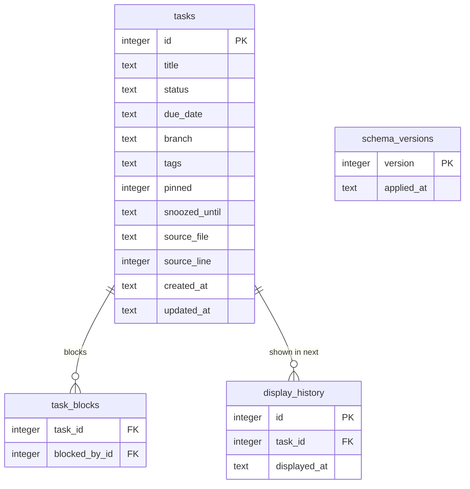
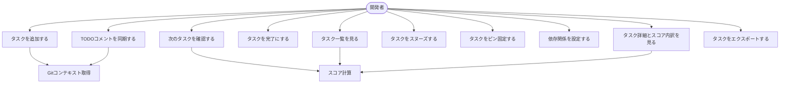
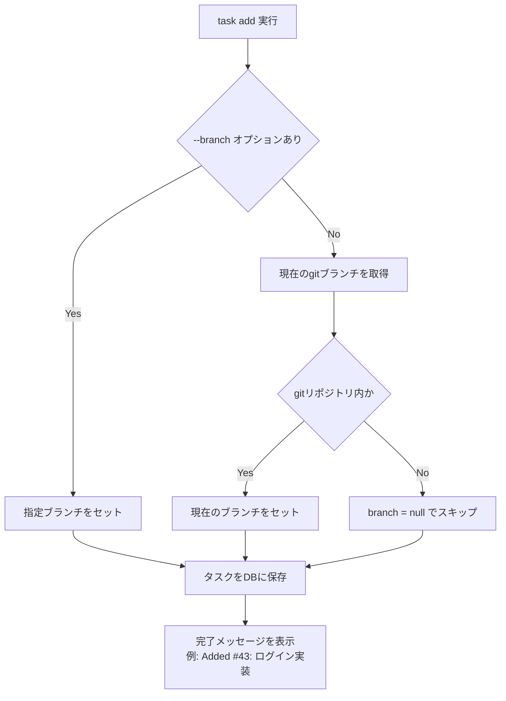
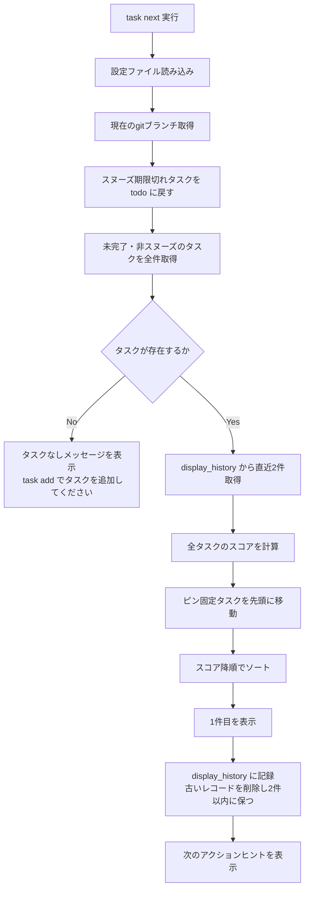
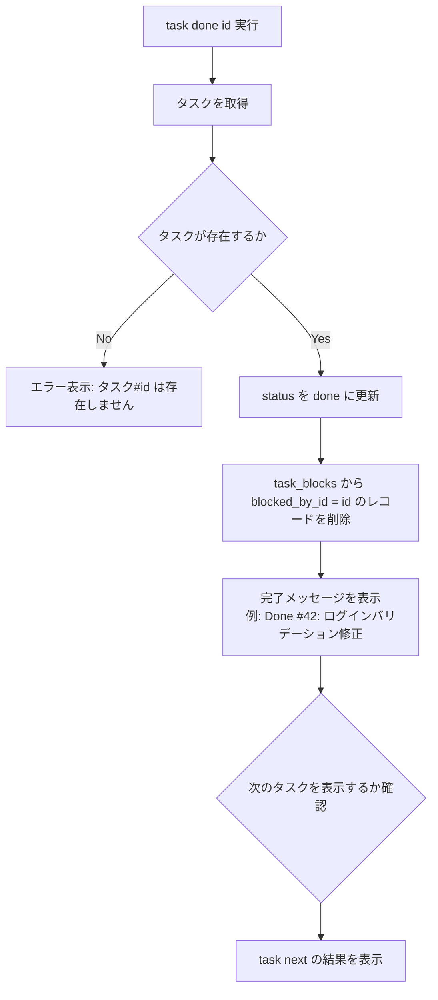
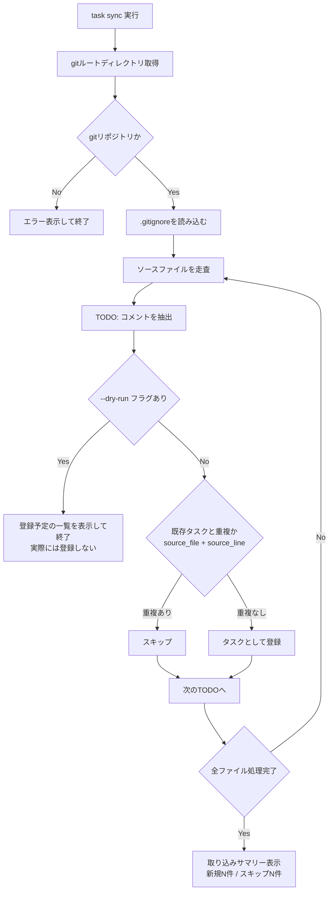

# 機能設計書

## 1. システム構成図

```
┌─────────────────────────────────────────────────────────┐
│                    ユーザー（ターミナル）                   │
└───────────────────────────┬─────────────────────────────┘
                            │ コマンド入力
                            ▼
┌─────────────────────────────────────────────────────────┐
│                      CLI パーサー                         │
│      コマンド・オプションを解析し各ユースケースへルーティング  │
└──┬─────────────────────────────────────────────────────┘
   │
   ├──────────────────┐
   ▼                  ▼
┌──────────────┐  ┌──────────────┐
│ コンフィグ   │  │  Git コンテ  │
│ ローダー     │  │  キストプロ  │
│              │  │  バイダー    │
└──────┬───────┘  └──────┬───────┘
       │ preset/weights   │ branch name
       │                  │
       ▼                  ▼
┌─────────────────────────────────┐
│           スコアエンジン          │
│  Task + context → ScoreResult   │
└──────────────┬──────────────────┘
               │
               ▼
┌─────────────────────────────────┐     ┌──────────────┐
│        タスクリポジトリ           │────▶│   SQLite     │
│  CRUD / filter / lock 管理      │     │  tasks.db    │
└──────────────┬──────────────────┘     └──────────────┘
               │
               ▼
┌─────────────────────────────────┐     ┌──────────────┐
│         TODO スキャナー           │────▶│ ソースファイル │
│  .gitignore 尊重 / 重複チェック   │     │ （リポジトリ）│
└──────────────┬──────────────────┘     └──────────────┘
               │
               ▼
┌─────────────────────────────────┐
│          出力レンダラー            │
│  カラー / テーブル / JSON / stderr │
└─────────────────────────────────┘
```

### データ保存場所

| ファイル | パス | 用途 |
|--------|------|------|
| データベース | `~/.task/tasks.db` | タスクデータ・表示履歴・スキーマバージョン（SQLite） |
| 設定ファイル | `.taskrc`（カレントから上位へ探索）または `~/.taskrc` | スコア重みなどの設定 |

`display_history` はSQLiteの `tasks.db` 内のテーブルとして管理する。JSONファイルは使用しない。

`.taskrc` の探索順：カレントディレクトリから親ディレクトリへ順に探索し、最初に見つかったものを使用する。見つからない場合は `~/.taskrc` を使用する。

---

## 2. コンポーネント設計

### 2-1. CLIパーサー

コマンドライン引数を解析し、対応するユースケースへルーティングする。

**責務：**
- コマンドとサブコマンドの識別
- オプションフラグの解析と型変換
- 不正な入力に対するエラーメッセージ表示（stderr出力）
- `--help` の出力

**サポートするコマンド一覧：**

| コマンド | オプション | 説明 |
|---------|-----------|------|
| `task add <title>` | `--due <date>` `--branch <name>` `--tag <tag>` | タスク追加 |
| `task list` | `--status <status>` `--tag <tag>` `--json` | 一覧表示（スコア順） |
| `task next` | `--json` | 次にやるべきタスクを1件表示 |
| `task show <id>` | `--json` | タスク詳細とスコア内訳表示 |
| `task done <id>` | | タスクを完了にする |
| `task edit <id>` | | `$EDITOR` でタスクをYAML編集 |
| `task pin <id>` | | タスクをピン固定する |
| `task unpin <id>` | | ピンを外す |
| `task snooze <id> <duration>` | | タスクを一時除外（例: `2d`, `1w`） |
| `task block <id> --by <id>` | | 依存関係を設定 |
| `task unblock <id> --by <id>` | | 依存関係を解除 |
| `task sync` | `--dry-run` | コード内TODOを取り込む |
| `task export` | `--format md\|json` | データをエクスポート |

**スヌーズ期間の書式：**

| 指定形式 | 意味 | 例 |
|---------|------|-----|
| `<n>d` | n日後まで除外 | `2d` = 2日後 |
| `<n>w` | n週間後まで除外 | `1w` = 7日後 |

時間単位（`h`）はサポートしない。スヌーズは日単位で管理する。

---

### 2-2. コンフィグローダー

`.taskrc` を読み込みアプリ全体の設定を提供する。

**責務：**
- `.taskrc` の探索（カレントディレクトリから上位へ）
- 設定値のパースとバリデーション
- 不正な設定値に対するエラーメッセージ表示
- デフォルト値の適用（`preset = "balanced"`）

**出力：**
```
Config {
  preset         : "deadline" | "balanced" | "flow"
  weights        : WeightMap   # プリセットから導出
  timezone       : string      # デフォルト: システムタイムゾーン
  no_color       : boolean     # NO_COLOR 環境変数も参照
}
```

---

### 2-3. タスクリポジトリ

SQLiteに対するCRUD操作を担う。スコアリングや表示ロジックは持たない。

**責務：**
- タスクの作成・取得・更新・削除
- ステータス・タグ・ブランチによるフィルタリング
- 同時書き込み防止のためのファイルロック管理
- 初回起動時の `~/.task/` ディレクトリおよびDB自動作成
- アップデート時のスキーママイグレーション実行

**初回起動時の処理：**
`~/.task/tasks.db` が存在しない場合、自動的にディレクトリとDBを作成してテーブルを初期化する。ユーザーへの確認は不要。

**スヌーズ再アクティブ化のタイミング：**
`task list` / `task next` 実行時に遅延評価する。`snoozed_until < 現在日付` のタスクはクエリ時点でステータスを `todo` に戻す（デーモン不要）。

---

### 2-4. スコアエンジン

タスク1件のスコアを計算する。外部状態（gitブランチ、現在時刻）はすべて引数として受け取り、副作用を持たない。

**責務：**
- 5要素（緊急度・重要度・コンテキスト・経年・疲労）の算出
- プリセット重み係数の適用
- スコア内訳の返却

**入力：**
- Task オブジェクト
- 現在のgitブランチ名
- 現在日時
- 直近の `task next` 表示履歴（タスクID配列、最大2件）
- Config オブジェクト

**出力：**
```
ScoreResult {
  total      : number
  urgency    : number
  importance : number
  context    : number
  aging      : number
  fatigue    : number
}
```

---

### 2-5. Gitコンテキストプロバイダー

gitコマンドを外部プロセスとして実行し、現在のコンテキストを取得する。

**責務：**
- 現在のブランチ名取得（`git branch --show-current`）
- gitリポジトリ外かどうかの判定
- gitルートディレクトリの取得（`git rev-parse --show-toplevel`）

gitリポジトリ外で実行された場合は `null` を返し、エラーにしない。

---

### 2-6. TODOスキャナー

リポジトリ内のソースファイルを走査し、`TODO:` コメントを抽出する。

**責務：**
- `.gitignore` を尊重したファイル走査
- `TODO:` コメントの抽出（対応フォーマット: `// TODO: <内容>`, `# TODO: <内容>`, `/* TODO: <内容> */`）
- 既存タスクとの重複判定（`source_file` + `source_line` の組み合わせ）
- 新規タスクの作成と取り込み結果サマリーの返却

---

### 2-7. 出力レンダラー

ターミナル向けのフォーマット済み文字列を生成する。

**責務：**
- テーブル・ボックス・カラーを用いた見やすい出力
- `--json` フラグ時のJSON出力への切り替え
- `NO_COLOR=1` 環境変数または設定時のカラーなし出力
- エラーメッセージの stderr 出力
- `--verbose` 時のデバッグ情報出力

---

## 3. データモデル定義

### ER図



### テーブル定義

**tasks**

| カラム | 型 | 制約 | 説明 |
|--------|-----|------|------|
| id | INTEGER | PK, AUTOINCREMENT | タスクID（1から連番） |
| title | TEXT | NOT NULL | タスク本文 |
| status | TEXT | NOT NULL, DEFAULT 'todo', CHECK IN ('todo','in_progress','done','snoozed') | ステータス |
| due_date | TEXT | NULL | 締め切り日（YYYY-MM-DD） |
| branch | TEXT | NULL | 紐付けるgitブランチ名 |
| tags | TEXT | NULL, DEFAULT '[]' | JSON配列文字列（例: `["auth","bug"]`） |
| pinned | INTEGER | NOT NULL, DEFAULT 0, CHECK IN (0,1) | 1=ピン固定 |
| snoozed_until | TEXT | NULL | スヌーズ解除日（YYYY-MM-DD） |
| source_file | TEXT | NULL | TODO同期元ファイルパス |
| source_line | INTEGER | NULL | TODO同期元行番号 |
| created_at | TEXT | NOT NULL | 作成日時（ISO 8601） |
| updated_at | TEXT | NOT NULL | 更新日時（ISO 8601） |

> **`tags` の設計について：** タグはJSON文字列として格納する。SQLiteのJSON関数（`json_each`）でのフィルタリングは可能だが、複雑なタグ検索が必要になった場合は正規化テーブルへの移行を検討する。v1ではタグ検索の頻度が低いためこの設計を採用する。

**task_blocks**

| カラム | 型 | 制約 | 説明 |
|--------|-----|------|------|
| task_id | INTEGER | FK → tasks.id ON DELETE CASCADE | ブロックされているタスク |
| blocked_by_id | INTEGER | FK → tasks.id ON DELETE CASCADE | 完了待ちのタスク |

PRIMARY KEY: (task_id, blocked_by_id)

`blocked_by_id` のタスクが `done` になった場合、`task_blocks` レコードは自動的に削除する（アプリケーション層で処理）。タスク自体を削除した場合は `ON DELETE CASCADE` によりDBが自動削除する。

**display_history**

直近2件のみ保持し、疲労ペナルティ計算に使用する。`task next` 実行のたびに古いレコードを削除して2件以内に保つ。

| カラム | 型 | 制約 | 説明 |
|--------|-----|------|------|
| id | INTEGER | PK, AUTOINCREMENT | |
| task_id | INTEGER | FK → tasks.id ON DELETE CASCADE | 表示したタスクID |
| displayed_at | TEXT | NOT NULL | 表示日時（ISO 8601） |

**schema_versions**

| カラム | 型 | 制約 | 説明 |
|--------|-----|------|------|
| version | INTEGER | PK | スキーマバージョン番号 |
| applied_at | TEXT | NOT NULL | 適用日時（ISO 8601） |

### インデックス

```sql
CREATE INDEX idx_tasks_status    ON tasks(status);
CREATE INDEX idx_tasks_branch    ON tasks(branch);
CREATE INDEX idx_tasks_due_date  ON tasks(due_date);
CREATE INDEX idx_tasks_pinned    ON tasks(pinned);
```

---

## 4. ユースケース図



---

## 5. 主要フロー

### 5-1. `task add` フロー



---

### 5-2. `task next` フロー



---

### 5-3. `task done` フロー



---

### 5-4. `task sync` フロー



---

## 6. 画面設計（ターミナルUI）

### 6-1. `task next`（タスクあり）

```
┌─ Next Task ──────────────────────────────────────────┐
│ #42  ログインバリデーション修正                        │
│                                                       │
│  Score 65  |  due: 2d  blocks: 3  branch: ✓          │
│  urgency:30  deps:20  ctx:15  age:10  fatigue:-10     │
│                                                       │
│  $ task done 42     $ task snooze 42 1d              │
└───────────────────────────────────────────────────────┘
```

- `due` の色: 当日以内は赤、3日以内はオレンジ、それ以外は標準
- `branch: ✓` はブランチ一致時のみ表示

### 6-2. `task next`（タスクなし）

```
No tasks found.
  Add a task: task add "タスク内容"
  Import TODOs: task sync
```

---

### 6-3. `task list`（タスクあり）

```
  #    score  title                          due    branch        tags
  ──────────────────────────────────────────────────────────────────────
  42    65   ログインバリデーション修正      2d    feat/login    auth
  38    52   パスワードリセット実装          5d    feat/login    auth
  55    31   UIリファクタリング               -        -          front
  61    18   README更新                       -        -          docs
```

- `due` が当日以内は赤、3日以内はオレンジ
- 現在のブランチと一致する `branch` は太字

### 6-4. `task list`（タスクなし）

```
No tasks yet.
  Add a task: task add "タスク内容"
```

---

### 6-5. `task add` 完了時

```
Added #43: ログイン実装  [branch: feat/login]
```

---

### 6-6. `task done` 完了時

```
Done #42: ログインバリデーション修正

┌─ Next Task ──────────────────────────────────────────┐
│ #38  パスワードリセット実装                            │
│  ...                                                  │
└───────────────────────────────────────────────────────┘
```

完了後に自動で次のタスクを表示する。

---

### 6-7. `task show <id>`

```
#42  ログインバリデーション修正
────────────────────────────────────────────
status    : todo
score     : 65
  urgency : 30  (締め切りまで2日)
  deps    : 20  (3件がこのタスク待ち → #38, #51, #60)
  context : 15  (ブランチ一致: feat/login)
  aging   : 10  (作成から5日未着手)
  fatigue : -10 (直前に表示済み)
due       : 2026-05-26 (2日後)
branch    : feat/login
tags      : auth
blocks    : #38, #51, #60
created   : 2026-05-19 (5日前)
────────────────────────────────────────────
メールアドレス形式とパスワード強度の
バリデーションが未実装。
```

---

### 6-8. `task sync --dry-run` 出力

```
Dry run: 以下のタスクが登録されます（実際には登録しません）

  src/auth/login.ts:42   TODO: メールアドレスのバリデーション追加
  src/auth/login.ts:87   TODO: レートリミット実装

2 tasks would be added, 1 skipped (already exists).
Run without --dry-run to apply.
```

---

### 6-9. エラー表示

```
Error: タスク #99 は存在しません。
  利用可能なタスクを確認するには: task list

Error: gitリポジトリ外での実行です。
  task sync を使用するには git リポジトリ内で実行してください。

Error: .taskrc の設定が不正です。
  preset には "deadline", "balanced", "flow" のいずれかを指定してください。
```

- エラーはすべて標準エラー出力（stderr）に出力する
- 原因と対処法をセットで表示する
